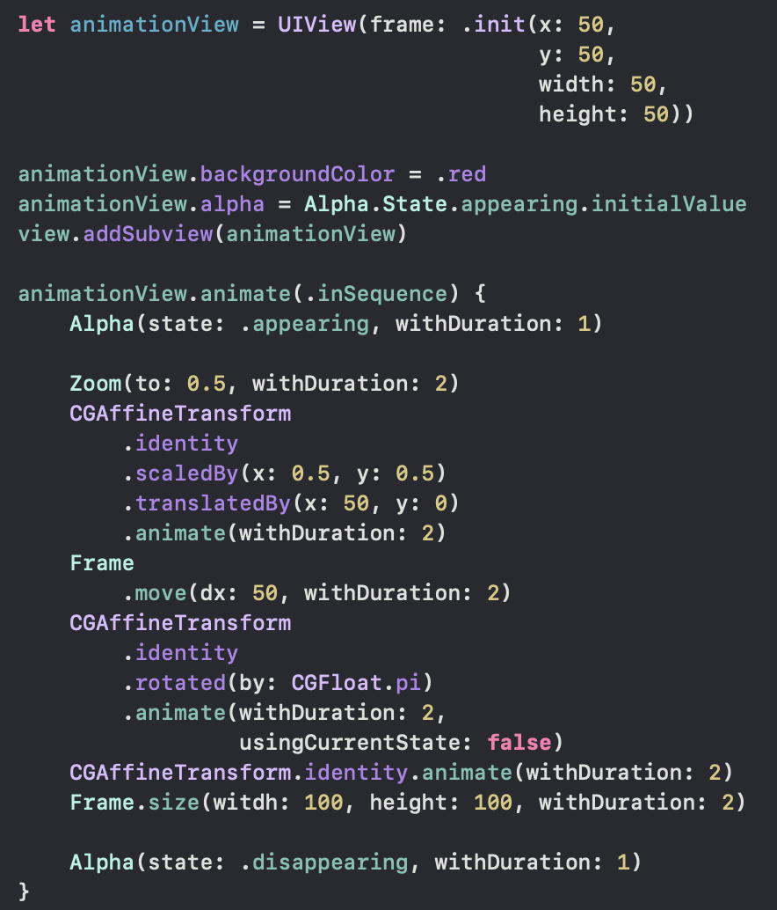

## Animation Builder

Playing with `@_functionBuilder` to create animations in a declarative way

## References:

- [building-a-declarative-animation-framework](https://www.swiftbysundell.com/posts/building-a-declarative-animation-framework-in-swift-part-2)
- [ViewAnimator](https://github.com/marcosgriselli/ViewAnimator)
